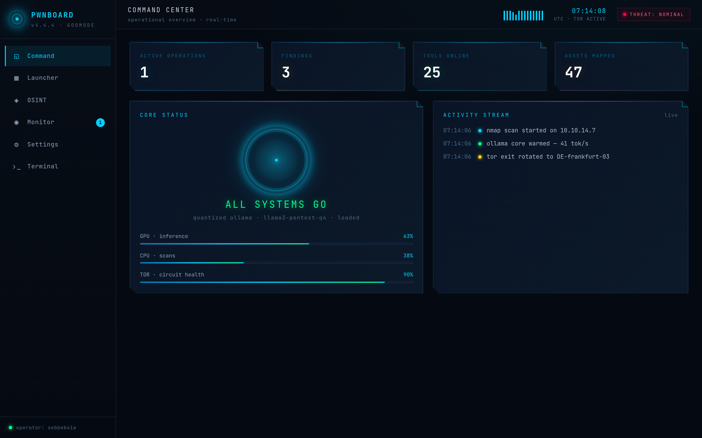

# PWNBOARD

A JARVIS-style pentest **command HUD** — the real implementation of the Claude Design
handoff in [`../project/PWNBOARD.dc.html`](../project/PWNBOARD.dc.html).



> More screens in the [top-level README](../README.md#skjermer--screens).

It is a **standalone runnable app built on the exported PwnboardUI design system**: the app
loads the design system's real component bundle (`vendor/pwnboard-ui/`) so every surface —
cards, badges, progress bars, the ArcReactor, the waveform — is the actual DS component, not
a re-creation. The prototype's `DCLogic` state machine is ported to a real React component in
[`src/app.jsx`](src/app.jsx).

> **Everything here is simulated.** Launching a "tool" spawns a fake job with a random
> progress bar; OSINT traces return hardcoded canned results; the terminal replies to a small
> scripted command set. It is a visual prototype (a theatrical HUD), exactly as designed —
> there is no real scanning, exploitation, or network tooling of any kind.

## Kom i gang / Getting started

Hent repoet ned og kjør appen lokalt — ingen byggesteg trengs (`app.js` er
ferdigbygget og committet, og React + design-systemet ligger vendret i `vendor/`,
så det kjører også offline):

```bash
git clone https://github.com/sebbeboia/GUI---GODMODE.git
cd GUI---GODMODE/app
node server.mjs            # → http://localhost:5173
# eller: python3 -m http.server 5173
```

Åpne `http://localhost:5173` i nettleseren.

Skal du **endre koden**? Rediger `src/app.jsx`, bygg på nytt, og oppdater nettleseren:

```bash
npm install               # esbuild (bygg) + playwright/react (dev/verifisering)
npm run watch             # bygger app.js på nytt ved hver endring
# npm run start           # bygg + serve i ett
# npm run verify          # headless test av alle seks skjermene
```

## Run it

No build step is required to run — `app.js` is committed pre-built, and React + the design
system are vendored locally, so it works fully offline (the HUD font is pulled from Google
Fonts when online, and falls back to a system monospace otherwise).

```bash
cd app
node server.mjs          # → http://localhost:5173
# or: python3 -m http.server 5173   (then open http://localhost:5173)
```

Open the printed URL in a browser.

## The six screens

| Screen | What it does |
|---|---|
| **Command center** | Live stat tiles, ArcReactor core status with GPU/CPU/Tor vitals, real-time activity stream. |
| **Tool launcher** | All 25 modules (12 Kali · 8 OSINT · 5 AI/device) as clickable tiles; launching one spawns a live job. |
| **OSINT workspace** | Pick a module, enter a target, run a trace → results render in a severity-graded `DataTable`. |
| **Operation monitor** | Running jobs with animating progress bars, status badges, and abort. |
| **Settings** | Engagement toggles, local-model select, SOCKS proxy / CIDR scope. |
| **Terminal** | A scripted root shell (`help`, `whoami`, `tools`, `scan <ip>`, `ai <prompt>`, `clear`) that echoes activity from across the app. |

Everything is wired together: launching a tool logs to the terminal and the activity feed, and
the findings counter ticks up as simulated scans complete.

## Develop

```bash
npm install        # esbuild (build) + playwright/react (dev/verify only)
npm run build      # compile src/app.jsx → app.js
npm run watch      # rebuild on change
npm run start      # build + serve
npm run verify     # headless smoke test of all six screens (writes verify-*.png)
```

## Layout

```
app/
├── index.html              # page shell: loads React → DS bundle → app.js, + global CSS glue
├── src/app.jsx             # the app source (real React port of the .dc.html DCLogic)
├── app.js                  # committed pre-built bundle (esbuild output)
├── server.mjs              # zero-dependency static server
├── verify.mjs              # headless Playwright smoke test
└── vendor/
    ├── react.production.min.js
    ├── react-dom.production.min.js
    └── pwnboard-ui/        # the exported design system (bundle JS + compiled CSS)
```

## Fidelity note

One defect was corrected from the source prototype: its Kali tool-tile mapping swapped the
description and hex-colour fields (`color:x[1], desc:x[2]` against data that lists the
description at index 1 and the colour at index 2), so every Kali tile printed `#00d4ff` as its
description and used the description string as an invalid CSS colour. The mapping now matches
the (correct) AI/OSINT convention, so the designed copy and palette render as intended. See the
comment in `src/app.jsx`.
